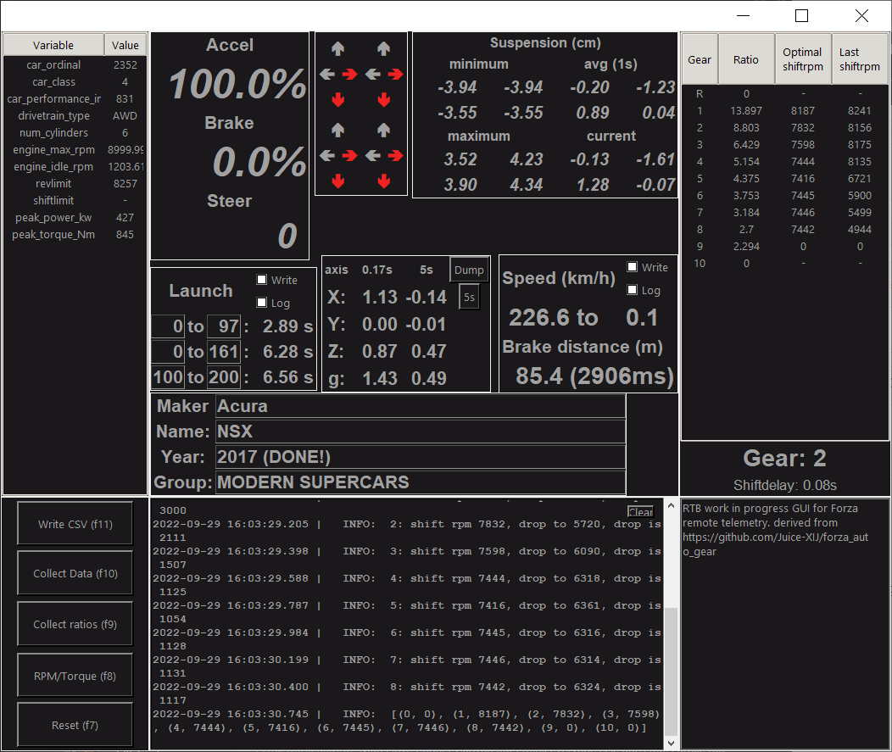
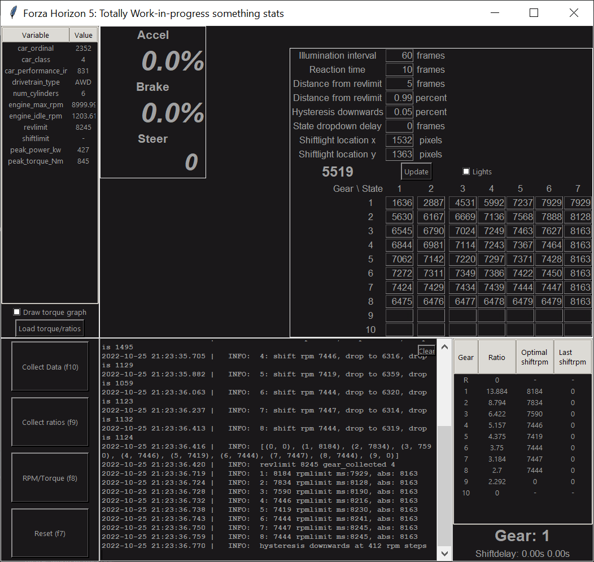
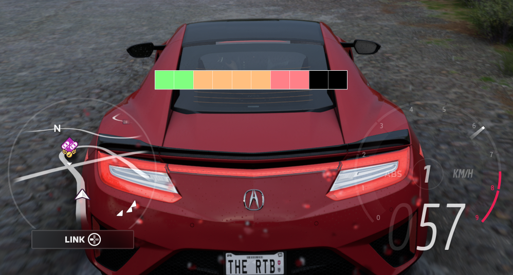
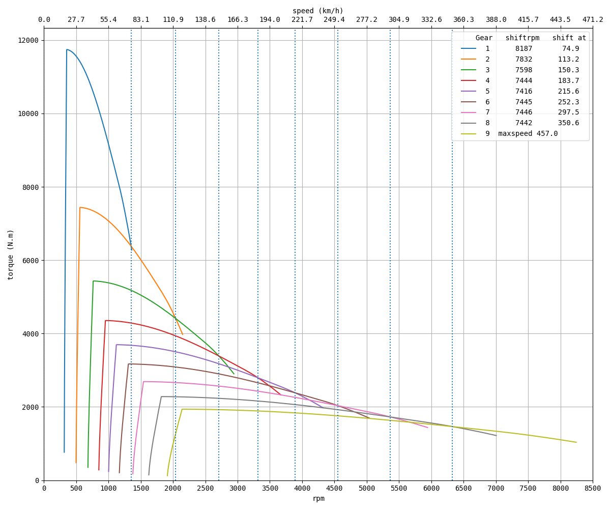
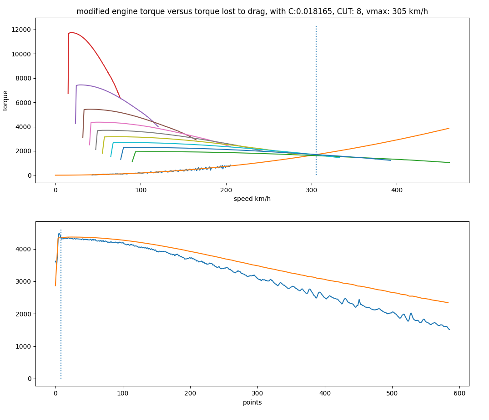
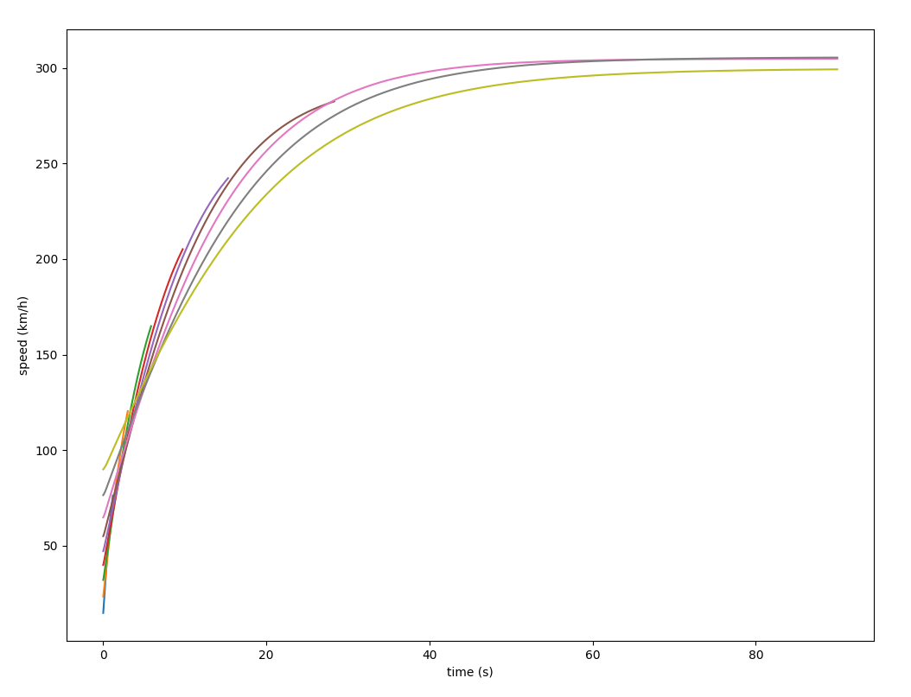

# ForzaGUI

GUI application for realtime display of telemetry and derived statistics and graphs for Forza Horizon 5

Added: 20-10-2022:  
**gui_ledonly.py** provides a separate always-on-top movable shiftlight window. The GUI has been simplified to primarily show variables related to the shift lights and can be edited to adjust the illumination live. The shift lights take drag into account using an approximation, this requires the torque graph at a gear affected by drag (think 3rd or 4th with 6 gears) but able to finish at the horizon drag strip (1.6km long, roughly).

This was a project never originally intended for public view, a hobby project for getting back to Python programming. Code quality is all over the place depending on when the function was written or updated. The GUI seems to be functional on Windows only.

There are various 'plugins' that offer telemetry readouts or derivations but may not be readily enabled unless the code responsible for placing the frames is updated. The plugins that are not currently active may not function or cause performance degradation.

Current focus is on making an accurate shiftled display. Work has been put into deriving information for an accurate progression of speed over time per gear, this will be used to derive more accurate triggers on rpm values to progress LED states. See dragderivation.py for various methods to derive top speeds, speed over time, and the impact of drag on modified engine torque. This applies to the torque value after multiplying with the gear ratio and multiplying the speed to match the ratio.

Examples of telemetry displayed, derived numbers and graphs:
- acceleration, brake, steering input
- car ordinal, PI, drivetrain, min/max/idle rpm
- derived peak power, torque, rev limit
- slip ratio visualized per wheel (longitudinal and lateral)
- absolute suspension values per wheel: min/max/avg/current
- launch statistics: 0 to 97kmh, 0 to 161 km/h and 100 to 200 km/h and ability to dump the data
- lateral G statistics: per X, Y, Z axis and total vector length, per frame or averaged over 300 frames with ability to dump the data
- brake statistics: start to end speed, distance and duration with ability to dump the data
- transmission statistics: per-gear ratio (no effective way to derive final ratio), duration of power cut (excludes clutch behavior)
- torque-per-gear graph: after collecting a full rpm sweep at moderate speed with per-gear ratio

Steps for collecting data per car:
- Press F10 to start monitoring
- Press F9 to enable ratio collecting
  - Drive around a bit per gear until number stabilizes in Ratio column bottom right
- Press F9 to stop ratio collecting
- Head to the main drag strip at the main Horizon Festival
  - Upgrade tire compound if car is traction limited, to slick or even drag if necessary
- Select an appropriate gear (4th gear is generally fine)
  - Gear must have enough torque to accelerate from idle rpm
  - Gear must be long enough to be affected by drag near rev limit 
  - Car must be able to accelerate from idle to rev limit within 1.6km/1mile
  - Do a test run if you are unsure, higher gears are more accurate
- Take note of the engine_idle_rpm, you want to be above this number to avoid clutch behaviour
- Align car with drag strip
- Press F8 and let RPM drop to near idle rpm
- Press and hold W (default keyboard key for accel)
- Release W after engine hits rev limit
- Click the Sweep button
- The data is saved. On restarts of the GUI click **Load torque/ratios** after clicking Connect (or pressing F10)

As the port is hardcoded to 12350, set remote telemetry in FH5 to 127.0.0.1 and port 12350.

Original GUI code by https://github.com/Juice-XIJ/forza_auto_gear

