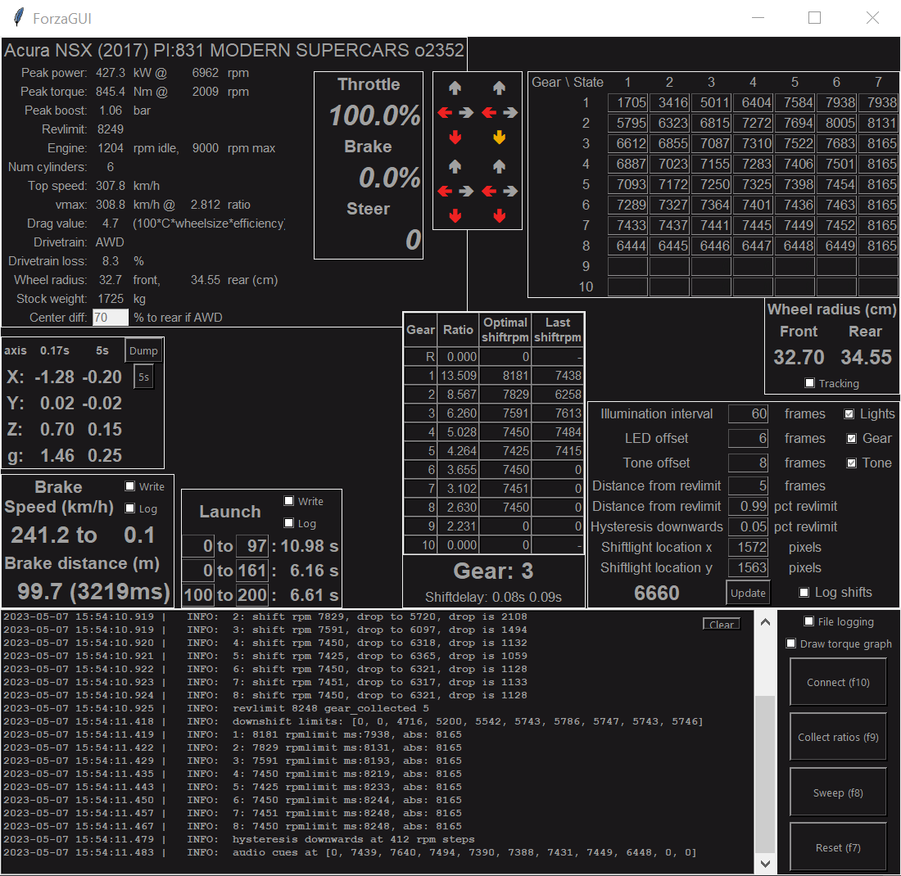
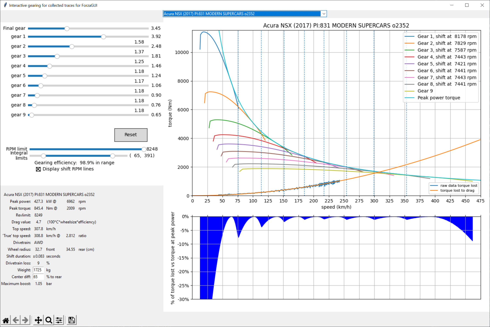

# ForzaGUI

### GUI application for realtime display of telemetry and derived statistics and graphs for the Forza series

Supports:  
Forza Motorsport  
Forza Horizon 5  

**Since a recent patch of Forza Horizon 5 (the one that added DLSS and more), there are Python installations that conflict with FH5. Any tkinter/matplotlib usage can cause FH5 to crash. The as-user installation of Python Anaconda with version 3.10.9 seems to be fine. Compiling using pyinstaller bypasses this problem. It is likely that FH5 registers these Python installations as potential hacking tools and will crash on detecting those, which is a shame in this case.**

The GUI provides a separate always-on-top movable shiftlight window with optional gear number and most parameters can be edited live to adjust the illumination and shift tone. The shift lights take drag into account using an approximation for time-consistent states, this requires the torque graph at a gear affected by drag (think 3rd or 4th with 6 gears) but able to finish at the horizon drag strip (1.6km long, roughly).

This was a project never originally intended for public view, a hobby project for getting back to Python programming. Code quality is all over the place depending on when the function was written or updated. The GUI seems to be functional on Windows only. Do not expect future updates.

There are various 'plugins' that offer telemetry readouts or derivations but may not be readily enabled unless the code responsible for placing the frames is updated. The plugins that are not currently active may not function or cause performance degradation.

Current focus is to derive drag and transmission efficiency to fully quantify drag comparisons between cars. This will require further investigation into slip ratio and inertial losses.

Previous focus was on making an accurate shiftled display. Work has been put into deriving information for an accurate progression of speed over time per gear, this will be used to derive more accurate triggers on rpm values to progress LED states. See dragderivation.py for various methods to derive top speeds, speed over time, and the impact of drag on modified engine torque. This applies to the torque value after multiplying with the gear ratio and multiplying the speed to match the ratio.

I'm aware of shortcomings around the non-linear ratio of engine rpm and speed due to slip ratio, as well as a lack of correction in early gears for engine inertia.

### Examples of telemetry displayed, derived numbers and graphs:
- acceleration, brake, steering input
- car ordinal, PI, drivetrain, min/max/idle rpm
- derived peak power, torque, boost, rev limit, drag, guesstimate drivetrain loss based on stock weight
- slip visualized per wheel (longitudinal and lateral)
  - past peak grip (slip > 1): color orange
  - lost grip (slip > 2): color red (number 2 is arbitrarily chosen)
- absolute suspension values per wheel: min/max/avg/current
- launch statistics: 0 to 97kmh, 0 to 161 km/h and 100 to 200 km/h and ability to dump the data
- lateral G statistics: per X, Y, Z axis and total vector length, per 10 frames or averaged over 300 frames with ability to dump the data
- brake statistics: start to end speed, distance and duration with ability to dump the data
- transmission statistics: per-gear ratio (no effective way to derive final ratio), duration of power cut (excludes clutch behavior)
- torque-per-gear graph: after collecting a full rpm sweep at moderate speed with per-gear ratio
- lap times: best, current, number of laps (needs update)
- 2D map

### Steps for collecting data per car tune:
- Easiest place to collect data is at the drag strip at the main Horizon Festival
- Press F10 to start monitoring
- Coast at low speed (~8-20km/h) at a high gear or clutch held with no inputs, to measure wheel size
  - The GUI will notify you when an accurate wheel size has been derived
- Press F9 to enable ratio collecting
  - Drive around a bit per gear until number stabilizes in Ratio in gearstats display
  - AWD cars can have a floating ratio and are not quite right yet, to be investigated (center diff and different front/rear wheel sizes are involved)
- Press F9 to stop ratio collecting
- Select an appropriate gear (4th gear is generally fine)
  - Gear must have enough torque to accelerate from idle rpm
  - Gear must be long enough to be affected by drag near rev limit 
  - Car must be able to accelerate from idle to rev limit within 1.6km/1mile
  - Do a test run if you are unsure, higher gears are more accurate
  - The run must be completed entirely on tarmac
- Take note of the engine_idle_rpm, you want to be above this number to avoid clutch behaviour
- Align car with drag strip at either far side
- Press F8 and let RPM drop to near idle rpm
- Press and hold W (default keyboard key for accel)
- Release W after engine hits rev limit
- Click the Sweep button
- The data is saved. The GUI will automatically try to load the data file based on car ordinal and PI number on restarts.

As the port is hardcoded to 12350, set Data Out in the Gameplay and HUD menu to 127.0.0.1 and port 12350.

### Interactive Gearing
A secondary application to dynamically alter gearing ratios for a given trace for a given car. Derives gearing efficiency relative to a perfect transmission and interactively determines optimal shift rpms (but does not yet take the impact of reduced/negative boost from turbo into account). The RPM limit is useful in determining the impact of automatic shifting, which always happens at redline when accelerating normally. Top speed is derived from comparing derived drag to the peak power curve. The wheel drag value should be mostly valid for comparing drag between cars though you should assume a fair margin of error, AWD cars with different front/rear wheel sizes may not be that accurate either. Final gear is an approximation, there is no way to derive final gear from just telemetry.
The derived shift rpm values are valid if and only if: at full throttle, shift duration of 0, not grip limited

### Configuration
Configuration is done through editing the json files that are regenerated with defaults when deleted. There are no input checks, the GUI will just break if input variables are not as expected. The script accepts a specific configuration file by providing the filename as first argument.
#### settings_gui.json
* window_offset_x: Initial spawn location of GUI window on the horizontal axis. This is useful for moving the window to a secondary monitor on launch.
* window_offset_y: Initial spawn location of GUI window on the vertical axis.
* plugins: Various plugin names
  * enabled: Whether plugin is enabled or not
  * frame name: internal name of frame
    * anchor: tkinter anchor
    * relx: relative x position of the frame, from 0 to 1. Plugins are primarily placed in the top frame of the GUI.
    * rely: relative y position of the frame

#### settings_guiled.json
Settings file for the shiftlights. Most settings apart from led_height, led_width and sequence are also editable inside the GUI and saved on clicking the Update button. Telemetry is sent 60 times per second, one *frame* is therefore 16.66... milliseconds.
* shiftlight_x: Initial spawn location of the shiftlight window on the horizontal axis, defaults to 960
* shiftlight_y: Initial spawn location of the shiftlight window on the vertical axis, defaults to 540
* illumination_interval: Duration of shiftlight interval. It is the distance between the first state lighting up and the optimal shift rpm, defaults to 60 frames (one second)
* reaction_time: time in frames to react to the shift state (all cyan). Optimal shift rpm is x frames into the shift state. Must be between 0 and 1/5th of the interval. Defaults to 10 frames.
* reaction_time_tone: Shift tone (of 200ms) plays x frames before the optimal shift. This assumes flat ground and acceleration relative to the torque graph.
* distance_from_revlimit_ms: distance in frames from hitting rev limit. Due to the cost of hitting rev limit, we force a minimum distance in time and absolute value. Optimal shift rpm is shifted according to this number. Defaults to 5 frames.
* distance_from_revlimit_pct": distance as a percentage of rev limit. The optimal shift rpm is shifted lower if it is closer than x% to rev limit. Defaults to 99% as 0.99.
* hysteresis_pct_revlimit: Shiftlight state is only allowed to drop after live rpm has dropped by this value (taken as a percentage of rev limit) below state trigger rpm. Defaults to 5% as 0.05.
* state_dropdown_delay: After going up in state, state may not drop for x frames. Defaults to 0 currently. Non-functional at the moment.
* led_height: Vertical size of LED rectangles in shiftlight window. Defaults to 40 pixels (may be affected by scaling in Windows)
* led_width: Horizontal size of LED rectangles in shiftlight window. Defaults to 40 pixels (may be affected by scaling in Windows)
* sequence: Pattern style. *"linear"* is left to right (McLaren pattern), *"sides"* is sides to center (Porsche pattern). Defaults to *"linear"*

Original GUI code by https://github.com/Juice-XIJ/forza_auto_gear

Alternate LED bar:

Derivation on drag by equating engine torque to an acceleration trace:

Graph rendered inside the GUI when pressing the Sweep button with Draw torque graph enabled:

